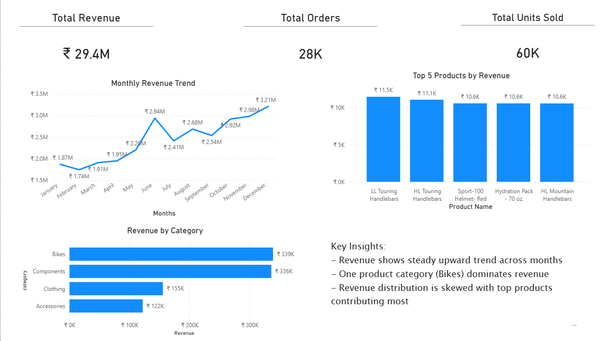

# End-to-End Sales Data Platform — PostgreSQL, SQL, Power BI

An end-to-end data engineering and analytics project that transforms raw data into actionable business insights using PostgreSQL, SQL, and Power BI.

The objective of this project is to design and implement a complete data pipeline that ingests raw data from multiple source systems (CRM and ERP), transforms it into a structured warehouse, and enables analytical reporting through SQL and Power BI..

---

## Architecture

The warehouse follows a **Medallion Architecture** approach:

### Bronze (Raw Layer)
- Ingests CSV files into PostgreSQL
- Loaded using Python (`psycopg2`) and `COPY`
- Basic ETL logging added to track load duration

### Silver (Clean Layer)
- Deduplication using window functions
- Data standardization and normalization
- Business rule application
- Data quality validation scripts

### Gold (Analytics Layer)
- Star Schema design:
  - `dim_customers`
  - `dim_products`
  - `fact_sales`
- Designed for straightforward analytical queries

After building the data warehouse, the project was extended to include an analytics layer and dashboarding.

## SQL Analytics Layer

* Created analytical SQL views on top of the Gold layer
* Aggregated sales, customer, and product data into business-ready datasets
* Implemented advanced queries such as:

  * Monthly revenue trends
  * Top-N product analysis
  * Customer segmentation
  * Revenue distribution analysis

## Power BI Dashboard

* Built an interactive dashboard using Power BI
* Connected to curated datasets (views)
* Designed KPI-driven visuals including:

  * Total Revenue, Orders, Units Sold
  * Monthly Revenue Trend
  * Top 5 Products by Revenue
  * Revenue by Category

## Key Insights

* Revenue shows consistent upward growth over time
* Revenue is highly concentrated among top products (skewed distribution)
* Bikes category contributes the highest revenue among valid categories
* Identified and handled data quality issues (missing categories)

- The project highlights the transition from data engineering to analytics by enabling decision-making through structured data pipelines
---

## Data Flow

CRM / ERP CSV Files  
→ Bronze Layer (Raw Ingestion)  
→ Silver Layer (Cleaning & Transformation)  
→ Gold Layer (Star Schema Modeling)  
→ SQL Views (Analytics Layer)  
→ Power BI Dashboard (Visualization)

## Project Structure

project/
├── datasets/
├── docs/
├── scripts/
├── sql/
│ ├── bronze/
│ ├── silver/
│ ├── gold/
│ ├── views.sql
│ └── analytics.sql
├── dashboard/
├── tests/
└── README.md

## Project Overview

This project involves:

1. **Data Architecture**: Designing a Modern Data Warehouse Using Medallion Architecture **Bronze**, **Silver**, and **Gold** layers.
2. **ETL Pipelines**: Extracting, transforming, and loading data from source systems into the warehouse.
3. **Data Modeling**: Developing fact and dimension tables optimized for analytical queries.
4. **Analytics & Reporting**:
   - Built SQL-based analytical views for business reporting
   - Developed an interactive Power BI dashboard for visualization
   - Derived key business insights from sales and product data.
   
---

## Why Star Schema?

The focus of this project is analytical querying and reporting.  
A Star Schema simplifies joins, improves readability, and keeps queries efficient. Since the scope is latest-state reporting, denormalized dimensions were appropriate.

---

## Tech Stack

- **PostgreSQL** — primary data store and transformation engine
- **Python + psycopg2** — ETL orchestration and data loading
- **SQL** — transformations, modeling, and analytics
- **Medallion Architecture** — Bronze / Silver / Gold layering
- **Star Schema** — dimensional model for the Gold layer

---
## Dashboard Preview

## About Me

Hi there! I'm **Samarth Mishra**. I’m a pre final year Computer Science and Engineering Student.

Let's stay in touch! Feel free to connect with me on the following platforms:

 
